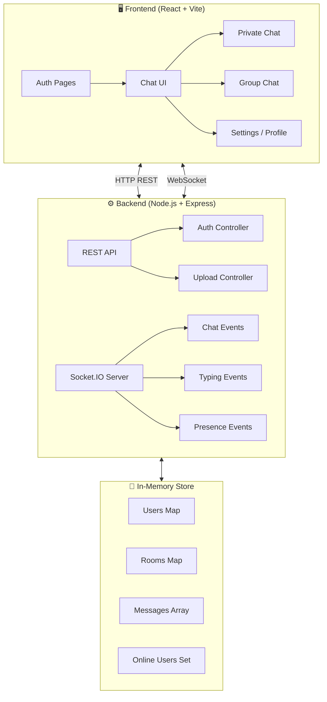

# 🚀 Rencana Implementasi: Web Chat App

## Deskripsi

Membangun aplikasi chat berbasis web dengan fitur **private chat** dan **group chat** yang real-time.
Karena tidak ada database, semua data akan disimpan **in-memory** di server (sesi berlangsung selama server berjalan).

---

## Stack Teknologi

| Layer | Teknologi | Alasan |
|---|---|---|
| **Language** | TypeScript | Type-safety end-to-end, lebih maintainable |
| **Package Manager** | Yarn | Lebih cepat, deterministic, dikonfirmasi user |
| **Frontend** | React + Vite | Cepat, hot-reload, ekosistem besar |
| **Backend** | Node.js + Express | Stabil, populer, mudah diintegrasikan dengan Socket.IO |
| **Real-time (Server)** | socketio-kit/server | Buatan Anda sendiri 🎉 — Express middleware, room helpers |
| **Real-time (Client)** | socketio-kit/client | Singleton client, auto cleanup, type-safe |
| **Auth** | JWT + Google OAuth | Secure, stateless, familiar |
| **UI Framework** | shadcn/ui | Komponen UI premium, siap pakai |
| **CSS** | Tailwind CSS v4 | Wajib untuk shadcn/ui |
| **Font** | Inter | Tipografi modern dan bersih |
| **Storage (file)** | Multer + penyimpanan lokal | Upload gambar/file dalam chat |
| **Port Backend** | `4000` | Dikonfirmasi user |
| **Port Frontend** | `5173` | Default Vite |

---

## Arsitektur Sistem



---

## Struktur Folder

```
apps/
├── server/                          # Backend (Node.js + Express + TypeScript)
│   ├── src/
│   │   ├── index.ts                 # Entry point
│   │   ├── config/
│   │   │   └── oauth.ts             # Google OAuth config
│   │   ├── middleware/
│   │   │   └── auth.ts              # JWT middleware
│   │   ├── store/
│   │   │   └── memory.ts            # In-memory data store
│   │   ├── types/
│   │   │   └── index.ts             # Shared types & interfaces
│   │   ├── routes/
│   │   │   ├── auth.ts              # Login, Register, OAuth
│   │   │   └── upload.ts            # File/Image upload
│   │   └── sockets/
│   │       ├── chat.ts              # Private & Group chat events
│   │       ├── typing.ts            # Typing indicator events
│   │       └── presence.ts          # Online/Offline status events
│   ├── uploads/                     # Folder untuk file yang diupload
│   ├── tsconfig.json
│   └── package.json
│
│   ├── public/
│   ├── src/
│   │   ├── assets/
│   │   ├── types/
│   │   │   └── index.ts             # Shared types (User, Message, Group, dll)
│   │   ├── components/
│   │   │   ├── auth/
│   │   │   │   ├── LoginForm.tsx
│   │   │   │   └── RegisterForm.tsx
│   │   │   ├── chat/
│   │   │   │   ├── ChatWindow.tsx
│   │   │   │   ├── MessageBubble.tsx
│   │   │   │   ├── MessageInput.tsx
│   │   │   │   ├── TypingIndicator.tsx
│   │   │   │   └── EmojiPicker.tsx
│   │   │   ├── sidebar/
│   │   │   │   ├── Sidebar.tsx
│   │   │   │   ├── UserItem.tsx
│   │   │   │   └── GroupItem.tsx
│   │   │   └── ui/                  # shadcn/ui components (auto-generated)
│   │   ├── pages/
│   │   │   ├── LoginPage.tsx
│   │   │   ├── RegisterPage.tsx
│   │   │   └── ChatPage.tsx
│   │   ├── hooks/
│   │   │   ├── useSocket.ts         # Custom hook untuk socketio-kit/client
│   │   │   ├── useAuth.ts
│   │   │   └── useNotification.ts
│   │   ├── context/
│   │   │   ├── AuthContext.tsx
│   │   │   └── ChatContext.tsx
│   │   ├── utils/
│   │   │   ├── api.ts               # Axios instance
│   │   │   └── formatTime.ts
│   │   ├── App.tsx
│   │   ├── index.css
│   │   └── main.tsx
│   ├── index.html
│   ├── tsconfig.json
│   ├── tsconfig.app.json
│   ├── package.json
│   └── vite.config.ts
│
└── package.json                     # Root package.json (workspaces)
```

---

## Fitur-Fitur Detail

### 1. 🔐 Autentikasi

- **Register**: Email + Password + Username
- **Login**: Email + Password
- **Google OAuth**: Login dengan akun Google
- **JWT**: Token disimpan di `localStorage`, dikirim di setiap request header

```
POST /api/auth/register   → Daftar dengan email & password
POST /api/auth/login      → Login, return JWT
GET  /api/auth/google     → Redirect ke Google OAuth
GET  /api/auth/google/callback → Callback, return JWT
GET  /api/auth/me         → Get current user profile
```

### 2. 💬 Private Chat

- Pilih user dari daftar online
- Kirim pesan teks secara real-time via Socket.IO
- Tampilkan riwayat pesan (dalam memori, hilang saat server restart)
- Read receipt: tanda ✓✓ ketika pesan sudah dibaca

**Socket Events:**
```
Emit:  "private:send"      { to, message }
On:    "private:receive"   { from, message, timestamp }
Emit:  "private:read"      { messageId, from }
On:    "private:read-ack"  { messageId }
```

### 3. 👥 Group Chat

- Buat grup baru (nama + deskripsi + tambah member)
- Kirim pesan ke grup
- Lihat anggota grup
- Admin bisa tambah/hapus member

**Socket Events:**
```
Emit:  "group:create"      { name, members[] }
Emit:  "group:send"        { groupId, message }
On:    "group:receive"     { groupId, from, message }
Emit:  "group:join"        { groupId }
On:    "group:user-joined" { groupId, user }
```

### 4. ⌨️ Typing Indicator

- Saat user mengetik, peserta lain melihat `"... sedang mengetik"`
- Auto-stop setelah 2 detik tidak ada input

```
Emit:  "typing:start"  { to/groupId }
Emit:  "typing:stop"   { to/groupId }
On:    "typing:update" { from, isTyping }
```

### 5. 🟢 Status Online/Offline

- Ketika user connect → broadcast "user online"
- Ketika user disconnect → broadcast "user offline"
- Tampilkan dot hijau/abu-abu di avatar

```
On:    "presence:online"   { userId, username }
On:    "presence:offline"  { userId, username }
On:    "presence:list"     [{ userId, username }]
```

### 6. 📤 Upload File/Gambar

- Upload gambar langsung di chat (max 5MB)
- Preview gambar sebelum dikirim
- Disimpan di folder `server/uploads/`

```
POST /api/upload   → multipart/form-data, return fileUrl
```

### 7. 😄 Emoji Reaction

- Hover/long-press pesan untuk memunculkan emoji picker
- Pilih emoji → tampil di bawah pesan
- Jumlah reaction diperbarui real-time

### 8. 🔔 Notifikasi Push Browser

- Menggunakan **Web Notifications API** (bawaan browser)
- Muncul saat tab tidak aktif dan ada pesan baru
- User diminta izin notifikasi saat pertama login

### 9. 🌙 Dark Mode / Light Mode

- Toggle di navbar
- Preferensi disimpan di `localStorage`
- Menggunakan CSS custom properties (`--bg-primary`, `--text-primary`, dll.)

---

## 🎉 socketio-kit — Package Buatan Anda

> [!NOTE]
> `socketio-kit` adalah package npm buatan **Doni Darmawan** (`darmawandoni6`) yang sudah publish di npm. Package ini adalah wrapper developer-friendly di atas Socket.IO dengan fitur:
> - ✅ **Zero Boilerplate** — init server/client dalam hitungan detik
> - ✅ **Express Middleware** — `req.socketSdk` siap pakai di semua route
> - ✅ **Room Helpers** — `toUser()`, `toRoom()`, `broadcast()` built-in
> - ✅ **Singleton Client** — satu instance, dipakai di seluruh app
> - ✅ **Auto Cleanup** — `on()` mengembalikan `unsubscribe()` function
> - ✅ **Type-Safe** — full TypeScript generics

### Cara Pakai di Backend (`socketio-kit/server`)

```typescript
import { socketSdk } from 'socketio-kit/server';

// Init di index.js
socketSdk.init(server, { cors: { origin: 'http://localhost:5173' } });
app.use(socketSdk.middleware());

// Di dalam Socket event handler
socketSdk.io.on('connection', (socket) => {
  // Private message → toUser()
  socket.on('private:send', ({ to, message }) => {
    socketSdk.toUser(to, 'private:receive', { from: socket.userId, message });
  });

  // Group message → toRoom()
  socket.on('group:send', ({ groupId, message }) => {
    socketSdk.toRoom(groupId, 'group:receive', { from: socket.userId, message });
  });
});
```

### Cara Pakai di Frontend (`socketio-kit/client`)

```typescript
import { socketClient } from 'socketio-kit/client';

// Connect sekali di App.jsx
socketClient.connect({ url: 'http://localhost:4000', userId: user.id });

// Subscribe di komponen (auto cleanup dengan return value)
const unsubscribe = socketClient.on('private:receive', (data) => {
  setMessages(prev => [...prev, data]);
});

// Emit
socketClient.emit('private:send', { to: recipientId, message });

// Cleanup saat unmount
useEffect(() => {
  const unsub = socketClient.on('private:receive', handler);
  return () => unsub(); // ← auto cleanup!
}, []);
```

---

## 🎨 Desain UI / UX

### Framework: shadcn/ui + Tailwind CSS v4

shadcn/ui **memerlukan Tailwind CSS** sebagai dependency. Ini sudah sesuai dengan request Anda.
Komponen shadcn/ui yang akan digunakan:
- `Button`, `Input`, `Avatar`, `Badge`
- `Dialog` / `Modal` (buat grup, konfirmasi)
- `ScrollArea` (area pesan)
- `Tooltip` (hover info)
- `DropdownMenu` (opsi pesan)
- `Separator`, `Sheet` (sidebar mobile)

### Typography: **Inter** (Google Fonts)

```css
@import url('https://fonts.googleapis.com/css2?family=Inter:wght@300;400;500;600;700&display=swap');

:root {
  font-family: 'Inter', sans-serif;
}
```

Alasan memilih **Inter**:
- Dirancang khusus untuk layar digital (legible di semua ukuran)
- Dipakai oleh Linear, Vercel, Notion, Figma
- Optimal untuk chat UI (teks panjang & pendek)

### Color Palette (Rekomendasi saya)

```css
/* === DARK MODE (default) === */
--background:      #0a0a0f;  /* Hampir hitam, nuansa biru gelap */
--card:            #111118;  /* Surface card */
--sidebar:         #0d0d14;  /* Sidebar lebih gelap */

--accent-violet:   #7c3aed;  /* Violet vibrant — warna utama */
--accent-violet-l: #a855f7;  /* Violet terang (hover) */
--accent-emerald:  #10b981;  /* Emerald — online status, success */
--accent-rose:     #f43f5e;  /* Rose — notifikasi, error */

--text-primary:    #f1f5f9;  /* Teks utama (hampir putih) */
--text-secondary:  #94a3b8;  /* Teks sekunder (abu slate) */
--text-muted:      #475569;  /* Teks disabled/placeholder */

--border:          #1e1e2e;  /* Border subtle */
--message-sent:    #4c1d95;  /* Bubble pesan terkirim (ungu gelap) */
--message-recv:    #1e1e2e;  /* Bubble pesan diterima (abu gelap) */

/* === LIGHT MODE === */
--background:      #f8fafc;
--card:            #ffffff;
--sidebar:         #f1f5f9;
--accent-violet:   #7c3aed;
--text-primary:    #0f172a;
--text-secondary:  #475569;
--border:          #e2e8f0;
--message-sent:    #ede9fe;  /* Ungu muda untuk light mode */
--message-recv:    #f1f5f9;
```

**Kenapa Violet + Emerald?**
- Violet → premium, modern (dipakai Twitch, Linear, Figma)
- Emerald → hidup, segar → cocok untuk status online
- Kontras tinggi → aksesibilitas baik
- Kombinasi ini jarang dipakai app lokal → unik & standout

### Layout Utama

```
┌──────────────────────────────────────────────────────┐
│  NAVBAR: Logo  |  Search  |  Notif  |  Avatar  |  🌙 │
├─────────────┬────────────────────────────────────────┤
│             │                                        │
│  SIDEBAR    │          CHAT WINDOW                   │
│  ─────────  │  ─────────────────────────────────     │
│  🔍 Search  │  [Avatar] Username  🟢  [Options...]   │
│             │  ─────────────────────────────────     │
│  PRIVATE    │                                        │
│  ▸ User A 🔴│     [Message bubble - received]        │
│  ▸ User B   │                                        │
│  ▸ User C 🟢│          [Message bubble - sent]       │
│             │                                        │
│  GROUPS     │     [Image message]                    │
│  ▸ Group 1  │                                        │
│  ▸ Group 2  │     ⌨️ User A sedang mengetik...       │
│             │  ─────────────────────────────────     │
│  [+ Grup]   │  😄 📎 [ Ketik pesan...       ] [➤]   │
└─────────────┴────────────────────────────────────────┘
```

---

## Dependencies

### Backend (`server/package.json`)
```json
{
  "dependencies": {
    "express": "^4.18.x",
    "socketio-kit": "^0.1.0",
    "socket.io": "^4.8.x",
    "cors": "^2.8.x",
    "jsonwebtoken": "^9.0.x",
    "bcryptjs": "^2.4.x",
    "multer": "^1.4.x",
    "passport": "^0.7.x",
    "passport-google-oauth20": "^2.0.x",
    "express-session": "^1.17.x",
    "dotenv": "^16.x"
  },
  "devDependencies": {
    "typescript": "^5.x",
    "ts-node": "^10.x",
    "tsx": "^4.x",
    "@types/express": "^4.x",
    "@types/node": "^20.x",
    "@types/jsonwebtoken": "^9.x",
    "@types/bcryptjs": "^2.x",
    "@types/multer": "^1.x",
    "@types/passport": "^1.x",
    "@types/passport-google-oauth20": "^2.x",
    "@types/express-session": "^1.x"
  }
}
```

### Frontend (`client/package.json`)
```json
{
  "dependencies": {
    "react": "^18.x",
    "react-dom": "^18.x",
    "react-router-dom": "^6.x",
    "socketio-kit": "^0.1.0",
    "socket.io-client": "^4.7.x",
    "axios": "^1.6.x",
    "emoji-picker-react": "^4.x",
    "react-hot-toast": "^2.x",
    "class-variance-authority": "^0.7.x",
    "clsx": "^2.x",
    "tailwind-merge": "^2.x",
    "lucide-react": "^0.x"
  },
  "devDependencies": {
    "vite": "^5.x",
    "@vitejs/plugin-react": "^4.x",
    "tailwindcss": "^4.x",
    "@tailwindcss/vite": "^4.x",
    "typescript": "^5.x",
    "@types/react": "^18.x",
    "@types/react-dom": "^18.x"
  }
}
```

> [!NOTE]
> **Package Manager: Yarn** — Semua perintah install menggunakan `yarn`, bukan `npm`.
> ```bash
> # Install dependencies
> yarn
> # Add package
> yarn add <package>
> yarn add -D <package>   # devDependency
> # Run scripts
> yarn dev
> yarn build
> ```
>
> **shadcn/ui** tidak diinstall sebagai npm package — komponennya di-*copy* langsung ke project via CLI (`yarn dlx shadcn@latest add button` dll). Ini adalah cara kerja shadcn/ui yang memungkinkan full customization.

---

## Urutan Implementasi

```mermaid
gantt
    title Urutan Implementasi Web Chat App
    dateFormat  X
    axisFormat  Step %s

    section Setup
    Init project struktur         :s1, 0, 1
    Install semua dependencies    :s2, after s1, 1

    section Backend
    In-memory store               :b1, after s2, 1
    Auth REST API (JWT)           :b2, after b1, 1
    Google OAuth                  :b3, after b2, 1
    File upload endpoint          :b4, after b3, 1
    Socket.IO server              :b5, after b4, 1
    Chat events (private & group) :b6, after b5, 1
    Typing & Presence events      :b7, after b6, 1

    section Frontend
    Design system & CSS tokens    :f1, after b2, 1
    Auth pages (Login, Register)  :f2, after f1, 1
    Layout & Sidebar              :f3, after f2, 1
    Chat window                   :f4, after f3, 1
    Socket integration            :f5, after f4, 1
    Upload & Emoji                :f6, after f5, 1
    Notifikasi & Dark mode        :f7, after f6, 1
```



---

## Keputusan yang Sudah Dikonfirmasi

> [!NOTE]
> **Google OAuth** ✅: Belum punya credentials. Saya akan menyiapkan file `.env.example` berisi placeholder + instruksi lengkap cara mendapatkan Google Client ID & Secret dari Google Cloud Console. Fitur Google OAuth akan berfungsi setelah user mengisi credentials.

> [!NOTE]
> **Data tidak persisten** ✅: Data pesan dan user disimpan in-memory dan akan hilang saat server di-restart. Ini sudah sesuai kebutuhan.

> [!NOTE]
> **Port** ✅: Backend berjalan di `http://localhost:4000` dan frontend di `http://localhost:5173`.

---

## Setup Google OAuth (Dilakukan Setelah Implementasi)

1. Buka [Google Cloud Console](https://console.cloud.google.com/)
2. Buat project baru
3. Masuk ke **APIs & Services → Credentials**
4. Klik **Create Credentials → OAuth 2.0 Client IDs**
5. Application type: **Web application**
6. Tambahkan Authorized redirect URI: `http://localhost:4000/api/auth/google/callback`
7. Copy **Client ID** dan **Client Secret**
8. Isi di file `.env`:
   ```env
   GOOGLE_CLIENT_ID=your_client_id_here
   GOOGLE_CLIENT_SECRET=your_client_secret_here
   ```

---

## Rencana Verifikasi

### Manual Verification
1. ✅ Register user baru → berhasil dapat JWT
2. ✅ Login dengan email/password → berhasil
3. ✅ Login dengan Google OAuth → berhasil
4. ✅ Buka 2 tab browser, login sebagai 2 user berbeda
5. ✅ User A kirim pesan private ke User B → muncul real-time di User B
6. ✅ Buat grup, tambah User B → keduanya bisa chat
7. ✅ Typing indicator muncul saat salah satu mengetik
8. ✅ Status online/offline berubah saat user connect/disconnect
9. ✅ Upload gambar → muncul di chat
10. ✅ Emoji reaction → update real-time
11. ✅ Notifikasi browser muncul saat tab tidak aktif
12. ✅ Toggle dark/light mode → tersimpan di localStorage
